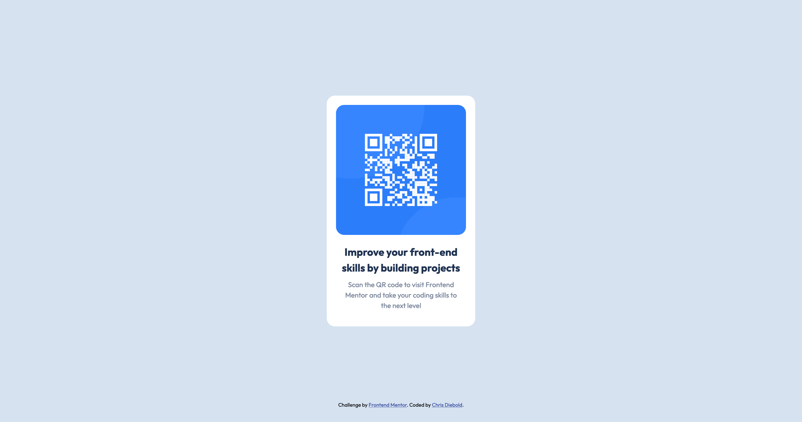

# Frontend Mentor - QR code component solution

This is a solution to the [QR code component challenge on Frontend Mentor](https://www.frontendmentor.io/challenges/qr-code-component-iux_sIO_H). Frontend Mentor challenges help you improve your coding skills by building realistic projects. 

## Table of contents

- [Frontend Mentor - QR code component solution](#frontend-mentor---qr-code-component-solution)
  - [Table of contents](#table-of-contents)
  - [Overview](#overview)
    - [Screenshot](#screenshot)
    - [Links](#links)
  - [My process](#my-process)
    - [Built with](#built-with)
    - [What I learned](#what-i-learned)
    - [Useful resources](#useful-resources)
  - [Author](#author)


## Overview
This is the solution to the frontend mentor QR code challenge. The solution is responsive. 

### Screenshot




### Links

- Solution URL: [Add solution URL here](https://your-solution-url.com)
- Live Site URL: [Add live site URL here](https://your-live-site-url.com)

## My process

There was no real process as this solution was pretty basic. The hardest part was centering everything on the page and I used relative positioning to acheive this affect. The image is rotated 90 degrees in mobile which was done using a media query. 

### Built with

- Semantic HTML5 markup
- CSS custom properties
- relative positioning

### What I learned

This was the first project I used media queries. I went with a mobile first approach. 

The most difficult part of this challenge was centering the QR code both veritically and horizontally on the page. 

For this I used this code: 
```css
.centered {
  position: absolute;
  top: 0;
  left: 0;
  right: 0;
  bottom: 0;
  margin: auto;
}
```

### Useful resources

- [Media Query MDN docs](https://developer.mozilla.org/en-US/docs/Web/CSS/Media_Queries/Using_media_queries) - This link helped me understand media queries.
## Author
- Website - [Add your name here](https://www.your-site.com)
- Frontend Mentor - [@chrisdiebold](https://www.frontendmentor.io/profile/chrisdiebold)
- Twitter - [@@cc_diebold](https://www.twitter.com/cc_diebold)